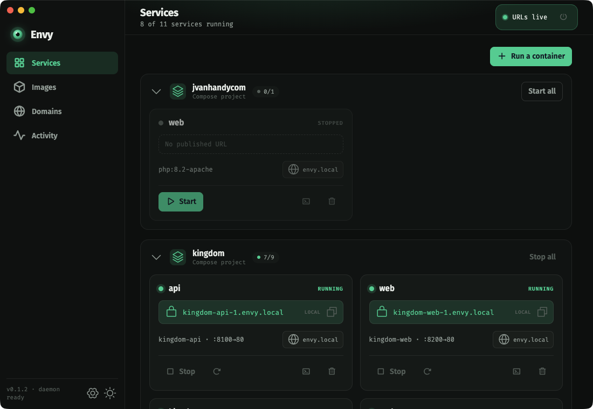

# Envy

> Every Docker container gets a real HTTPS URL.

[](https://github.com/MelodicDevelopment/envy/actions/workflows/ci.yml)
[](LICENSE)
[](https://www.electronjs.org)
[](https://github.com/MelodicDevelopment/melodic)

A free, open-source (MIT), cross‑platform container manager that gives every
Docker container a clean, auto‑generated `https://<name>.<domain>` URL — with
zero‑config HTTPS. Start a container and it's instantly reachable at a trusted
`https://` address: no port juggling, no `/etc/hosts` editing, no
self‑signed‑cert warnings.



Built with Electron + TypeScript and the [Melodic](https://github.com/MelodicDevelopment/melodic) component library.

> Envy is a **client + local networking layer**. It does not run containers
> itself — it talks to whatever Docker daemon you already have (Docker
> Desktop, **OrbStack**, colima, …) and adds the URL/HTTPS magic on top.

---

## What it does

- **See & control containers** — grouped by Compose project, with one‑click
  start/stop/restart/remove and live status.
- **Automatic URLs** — every running container gets `https://<name>.<domain>`,
  named by its Compose service (e.g. `https://api.envy.local`) or container
  name for standalone containers.
- **Zero‑config HTTPS** — a local Certificate Authority is generated and
  trusted once; every site gets a green lock.
- **Multiple, configurable domains** — serve `envy.local` *and* `acme.test`;
  scope each container to the domains you choose.
- **Run / pull / update images** — spin up a container from a form, pull
  images, and update a running service to the latest image in one click.
- **Inspect drawer** — live logs, an interactive shell (xterm + `docker exec`),
  environment, mounts, and details — resizable.
- **Activity monitor** — live CPU / memory / network / disk via `docker stats`,
  with sparklines.

## Install

Grab a prebuilt app from [GitHub Releases](https://github.com/MelodicDevelopment/envy/releases):

- **macOS** — universal `.dmg` (Apple Silicon & Intel)
- **Windows** — `.exe` installer (x64 & arm64)
- **Linux** — `.AppImage` (x64 & arm64)

Or build it from source (below).

## Build from source

Prerequisites: Node.js 20+, npm, and a local Docker engine (Docker Desktop,
OrbStack, or colima).

```bash
git clone https://github.com/MelodicDevelopment/envy.git
cd envy
npm install
npm run dev          # hot-reloading dev app
# or: npm run build && npm start

npm run typecheck    # TypeScript
npm test             # vitest suite
npm run package      # package a distributable for your platform
```

On first launch, click **“Enable URLs”** in the header. You’ll get **one**
native password prompt; Envy installs a small background service that serves
your URLs over HTTPS (and keeps doing so across reboots). That’s it — open a
running container’s URL and it loads with a green lock.

> Don’t have a Docker engine running? Envy detects your provider and offers a
> **“Start OrbStack/Docker Desktop”** button, then connects automatically once
> it’s up.

## OrbStack‑safety

Envy is designed to run **alongside OrbStack** (or any provider) without
disturbing it:

- It owns only its **own domains** and their `/etc/resolver/<domain>` files —
  it never touches `orb.local` or another tool’s resolver.
- It only starts/stops the **containers you act on**; it never reconfigures the
  daemon.
- Its reverse proxy detects port conflicts and refuses to start rather than
  fighting whatever holds a port.

## Per‑container configuration (labels)

Set these labels on a container (Compose or `docker run`) for infra‑as‑code
control — they take precedence over the in‑app settings:

| Label | Effect |
| --- | --- |
| `envy.host=api,admin` | Custom hostname(s): `api.<domain>`, `admin.<domain>` (a dotted value is used verbatim) |
| `envy.domains=envy.local,acme.test` | Restrict the container to these domains |
| `envy.port=8080` | Which container port to route to |
| `envy.enable=false` | Opt the container out of Envy entirely |

## Documentation

| Topic | Where |
|---|---|
| Full user guide (every screen and workflow) | [docs/user-guide.md](docs/user-guide.md) |
| Architecture — engine, daemon, routing model | [docs/architecture.md](docs/architecture.md) |
| Development — layout, packaging, signing, platforms | [docs/development.md](docs/development.md) |
| Hosted docs (same content, prettier) | [envy.melodic.dev/docs](https://envy.melodic.dev/docs) |
| Melodic component-library notes | [MELODIC-NOTES.md](MELODIC-NOTES.md) |

## Project layout

```
src/
  engine/      Discovery, routing, DNS, TLS/CA, hosts handling (pure Node, no Electron)
  daemon/      Privileged background daemon — DNS + reverse proxy on 53/80/443
  app/         Electron main process (tray, window, IPC handlers, updates)
  ipc/         Typed IPC contract between renderer and main process
  ui/          Renderer — Melodic web components (services, images, domains, activity)
  cli/         Internal engine/daemon entry points (not a distributed CLI)
docs/          User + contributor documentation
scripts/       Build, packaging, signing, release helpers
web/           Marketing site (PHP, deployed on Railway)
```

## Scripts

| Command | What it does |
|---|---|
| `npm run dev` | Launch the app in development mode (hot reload) |
| `npm run typecheck` | TypeScript type check (no emit) |
| `npm run lint` | ESLint over the whole repo |
| `npm test` | Run the Vitest suite |
| `npm run build` | Build main/preload/renderer bundles + the daemon |
| `npm run package` | Package a platform installer into `dist/` |

## Tech stack

- **Electron** 33 · **TypeScript** (strict, `noUncheckedIndexedAccess`)
- **Melodic** (`@melodicdev/core` + `@melodicdev/components`) for the UI
- **dockerode** (Docker socket) · **dns2** (local resolver) · **http-proxy**
  (reverse proxy) · **node-forge** (local CA + leaf certs) · **xterm.js**
  (exec shell)
- **electron-vite** for the build, **electron-builder** for packaging,
  **Vitest** for tests

## Status

macOS is fully supported. The UI is cross‑platform (web tech); the privileged
**daemon** (DNS + proxy + CA trust) is implemented for macOS, with Windows and
Linux as planned follow‑ups (see [Development](docs/development.md)).

## Contributing

Contributions are welcome — bug reports, feature requests, and pull requests.
See [CONTRIBUTING.md](CONTRIBUTING.md) for dev setup, how to run the tests,
and what to expect from the PR process. For anything non‑trivial, open an
[issue](https://github.com/MelodicDevelopment/envy/issues) first so we can
agree on the approach before you invest time.

Found a security issue? Please follow [SECURITY.md](SECURITY.md) instead of
opening a public issue.

## Roadmap

- **Windows daemon parity** — DNS + proxy + CA trust on Windows (in progress;
  the UI already runs there)
- **Linux daemon** — same privileged layer for native Linux
- **Native Linux packages** (`.deb`/`.rpm`) — AppImage ships today; real
  packages need the release build on a Linux runner
- **HTTPS upstream targets** — proxying to containers that themselves speak TLS
- **Compose profile awareness** in the services view

## Telemetry

None. Envy has no analytics and no crash reporting. The only network call it
makes is checking GitHub Releases for app updates.

## License

[MIT](LICENSE) © 2026 Rick Hopkins (Melodic Development).

Docker is a trademark of Docker, Inc. Envy is an independent project, not
affiliated with or endorsed by Docker, Inc.
